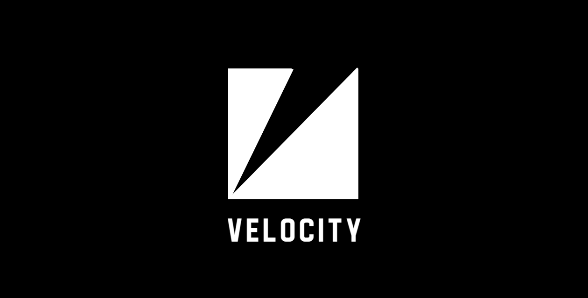

# Velocity 🎬✨



> **Create stunning motion graphics and animations using AI‑powered scenes**


> All examples in the demo was generated with ai.


Velocity is an AI‑assisted video editor that lets you create professional motion graphics by describing your vision in natural language or structured YAML. It builds React components from YAML, animates them with an expressive timeline, and previews instantly.

## 🌟 Features

- **🤖 AI‑Powered Scene Generation** — Describe your video and watch it come to life
- **📝 YAML‑Based Authoring** — Clean, predictable schema with shortcuts
- **🎨 Rich Elements** — Text, images, shapes, paths, groups, layouts
- **⚡ Real‑time Preview** — Fast dev server with hot reload
- **🎭 Advanced Animations** — Anime‑style steps, easing, stagger, timeline events
- **📱 Layout System** — Flex‑based containers and responsive patterns
- **🎯 3D Transforms** — Perspective and `z` depth available throughout
- **🎬 Export‑Ready** — Built on Remotion for high‑quality rendering

## 🚀 Quick Start

### Prerequisites
- Node.js 18+
- npm or yarn

### Installation

```bash
# Clone the repository
git clone https://github.com/0x-boss/velocity.git
cd velocity

# Install dependencies
npm install

# Start development server
npm run dev
```

Visit `http://localhost:5173` to see the editor in action.

## 🤖 Using Velocity with AI

Velocity pairs well with an LLM (ChatGPT, Claude, etc.) to author scenes:

1) Share these two documents with the model:
   - `docs/docs.md` — complete schema and rules
   - `docs/prompt.md` — strict instructions forcing a single valid YAML scene
2) Ask the model: “Generate ONE valid YAML scene. No Markdown fences. Output YAML only.”
3) Save the output to `public/examples/<name>.yaml`.
4) In `src/App.jsx`, update the fetch path or click an Example button to preview.

Tips for high‑quality AI outputs:
- Be concrete: specify sizes, gaps, paddings, and durations using whole numbers
- Prefer layout containers and `gap`/`padding` over `x/y` positioning
- Keep animations tight (0.4–0.8s) with gentle easings and small stagger
- Ask it to align initial props with `from` values to avoid jumping
- If the model invents unknown keys, remove them or replace with supported ones (see `docs/docs.md`)

## 📖 Manual Usage

### Basic Example

Create a simple scene in YAML:

```yaml
scene:
  name: "Hello World"
  width: 1280
  height: 720
  background: "#101214"
  elements:
    - type: text
      txt: "Hello, Velocity!"
      fs: 64
      color: "#fff"
      center: true
      animations:
        - steps:
            - type: anime
              duration: 1.0
              props:
                opacity: {from: 0, to: 1}
                y: {from: 20, to: 0}
```

### Advanced Features
- **Text targets** (chars/words) with stagger
- **Path motion** (draw‑on, follow path)
- **Timeline events** (`on`, `after`, `delay`)
- **Group‑level animations** targeting children
- **Camera transforms** (`x`, `y`, `z`, `scale`, `rotation`)

## 🎯 Examples

Included example scenes demonstrate different capabilities:
- Enhanced Bank Hack
- Bank Hacking Simulation
- Google Search → Website Transition

Load any example from the UI or browse `public/examples`.

## 📚 Documentation

- [Complete YAML Syntax Guide](docs/docs.md)
- [AI Prompt Guide](docs/prompt.md)
- API reference — coming soon

## 🛠️ Project Structure


```
velocity/
├── src/
│ ├── parser/          # YAML → React component builder
│ ├── player/          # Player wrapper and controls
│ └── components/      # UI components
├── public/
│ └── examples/        # Example scenes
├── docs/              # Docs, prompt guide, demo assets
```

## 🎨 Creating Your First Scene

1. Start simple with a headline and a block
2. Add motion via a short anime step
3. Use containers and `gap`/`padding` for layout
4. Sequence with timeline events and delays
5. Export with Remotion when ready

## ⚠️ Status

**🚧 In active development** — may have rough edges:
- Limited motion variation/presets
- AI may misinterpret complex prompts
- Some fine‑grained controls are still evolving

Feedback and contributions are welcome!

## 🤝 Contributing

See the [Contributing Guide](CONTRIBUTING.md) for:
- Local development setup
- Code style and conventions
- Submitting PRs and reporting issues

Open issues and discussions:
- Issues: https://github.com/0x-boss/velocity/issues
- Discussions: https://github.com/0x-boss/velocity/discussions

## 🗺️ Roadmap

- Enhanced prompt understanding
- More animation presets/effects
- Advanced 3D capabilities
- Audio synchronization
- Plugin system for custom elements
- Cloud rendering service
- Collaborative editing

## 🛡️ License

Licensed under **GPL‑3.0** — see [LICENSE](LICENSE) for details.

## 🙏 Acknowledgments

- [Remotion](https://remotion.dev)
- [Anime.js](https://animejs.com)
- React ecosystem

---
